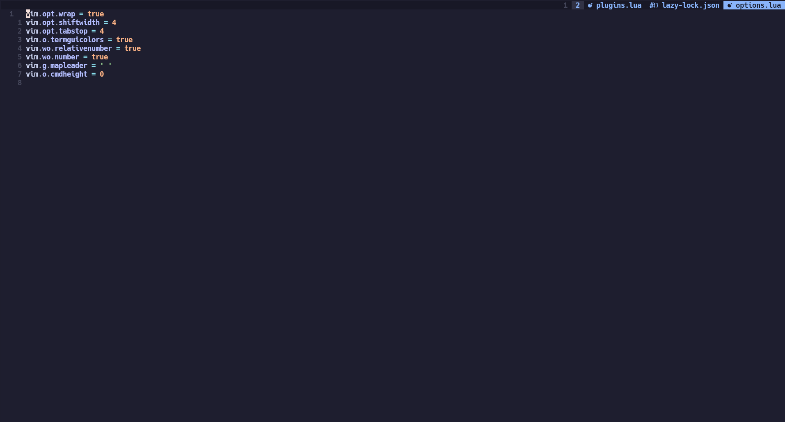

# My personal Neovim config

Feel free to use this, it is however tailored for me.

## Screenshot



## LSP

I recommend installing these LSPs for the lsp-zero config to work :)

```nix
roslyn
python312Packages.python-lsp-server
yaml-language-server
nil
jdt-language-server
texlab
marksman
nodePackages_latest.bash-language-server
typescript
nodePackages_latest.typescript-language-server
nodePackages_latest.vls
nodePackages_latest.volar
lua-language-server
tree-sitter
gopls
rust-analyzer
```
